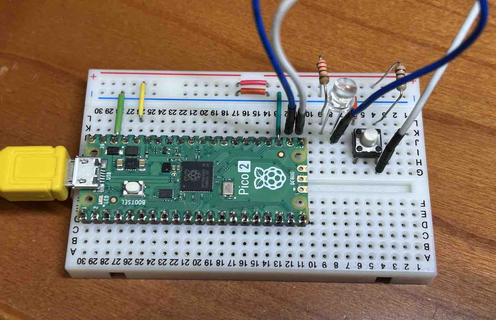

# 2025 12/18 インタラクティブプロダクト演習 サンプルコード

## 25suac_sample1

- pico2ボード上のLEDが点滅するだけの単純なプログラムです
- Arduino IDE上からRaspberry Pi Pico2に正常に書き込めるかを確認します
- BOOTSELボタンを押しながら USB Cable を指します
- 書き込む時にポート設定を UF2_Board にします
- ２回目以降は、ポート設定を USB シリアルっぽいものに変更すると、USB Cableを抜き差ししなくても書き込めます
  - ポート設定ができず、書き込めない場合もあります。その場合は、もう一度 BOOTSEL を押しながら USB Cable を抜き差ししてください。

## 25suac_sample2

- ブレッドボード上に、ボタンとLEDの回路を作成し、pico2と接続します
- USB Stack を Arduino TinyUSB に設定し、プログラムを書き込みます
- PC でソフトシンセを立ち上げて、ボードのスイッチを押すと音が鳴るはずです

